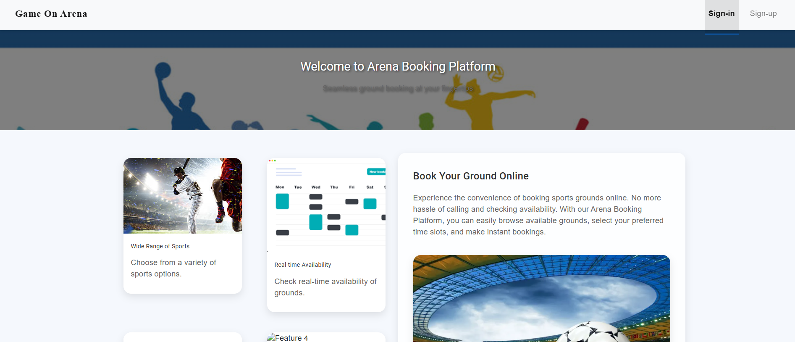
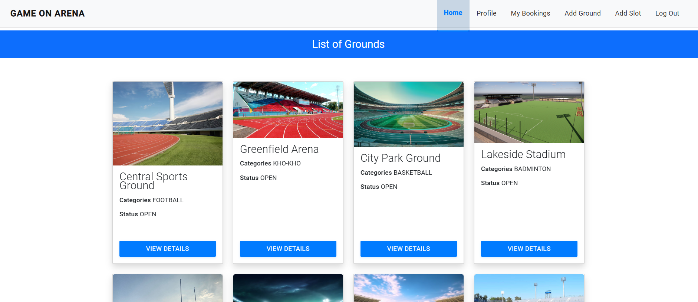
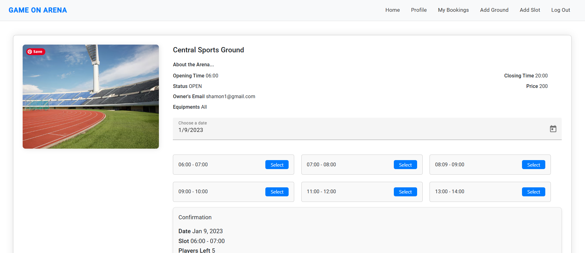
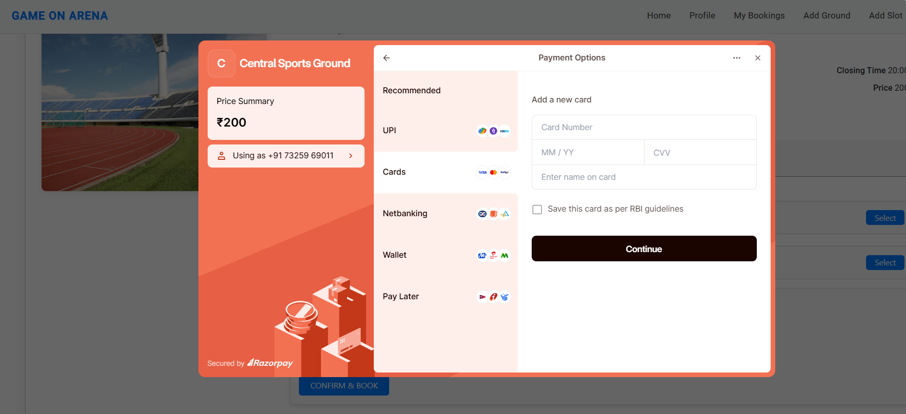

# Arena Booking System

  
  

## 📋 Overview

The **Arena Booking System** is a robust, scalable web platform built using microservices architecture designed to manage arena bookings for various events. Users can search for available arenas, view schedules, and make bookings. Owners can manage arenas, handle booking conflicts, and generate reports. The platform integrates with **Razorpay** for payment processing.

This system leverages key microservices principles such as **API Gateway**, **Role-based access control**, **Multithreading**, and **Scalability** to handle high traffic efficiently. Backend services are deployed in **Docker containers** to ensure portability, scalability, and consistency across environments.

---

## 🎥 View Video

Watch demo of the Arena Booking System:

https://github.com/user-attachments/assets/3cbfba66-488d-4bfe-8a9c-55a6b4c7e9bd

## 🖋️ Design

### **System Architecture**

The application is designed using a microservices architecture, ensuring scalability and modularity.

## 🚀 Features

### User Features:

- **Browse and search for arenas** based on location, type, and availability.
- **Real-time arena availability check** for instant booking decisions.
- **Book, modify, or cancel bookings** with a seamless workflow.
- **View booking history** to track past reservations.
- **Payment Integration**: Process payments securely through **Razorpay**.

### Admin Features:

- **Add, update, or remove arenas** from the system.
- **Manage booking requests** and resolve conflicts efficiently.

### Advanced Features:

- **Role-Based Access Control (RBAC)**: Users have different levels of access, ensuring secure operation for both admins and regular users.
- **API Gateway**: A single entry point for all services, managing traffic and enhancing security.
- **Authentication & Authorization (JWT)**: Secure login for users and admins, preventing unauthorized access.
- **Multithreading**: Support for handling concurrent requests, ensuring high performance in a multi-user environment.
- **Scalable Architecture**: Built with Docker and microservices for scalability and fault tolerance.
- **Razorpay Integration**: Handles secure payment processing for arena bookings.

---

## 🛠️ Technologies

### Backend:

- **Java Spring Boot** for building microservices-based RESTful APIs.
- **MySQL** for managing relational data with Hibernate ORM.
- **MongoDB** for flexible, non-relational data storage (for certain services).
- **Spring Security** for robust authentication and role-based authorization.

### Frontend:

- **Angular** for a dynamic and responsive user interface, with components for booking management, schedules, and user interaction.

### Other Tools:

- **Docker** for containerizing each microservice and managing multi-container applications using Docker Compose.

---

## 📷 Project Images

### 1. **Getting Started:**

_The starting page of the Arena Booking System._

### 2. **All View Dashboard:**

_Dashboard displaying all available features._

### 3. **Ground View:**

_Overview of available arenas for booking._

### 4. **Payment Integration:**

## _Payment integration with Razorpay for secure transactions._

## ⚙️ Installation

### Prerequisites:

- **Java 11+**
- **Docker & Docker Compose**
- **MySQL** (if running outside of Docker)
- **MongoDB** (configured for services that require non-relational data storage)
